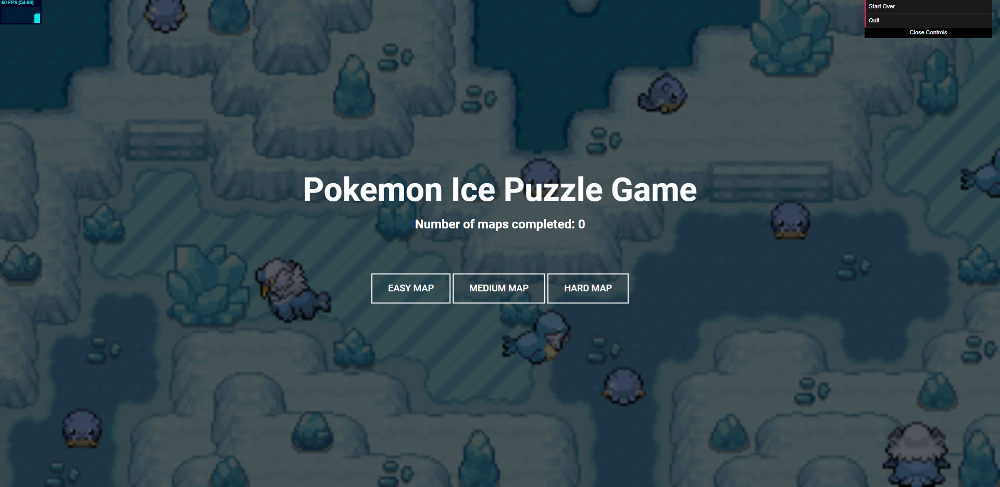
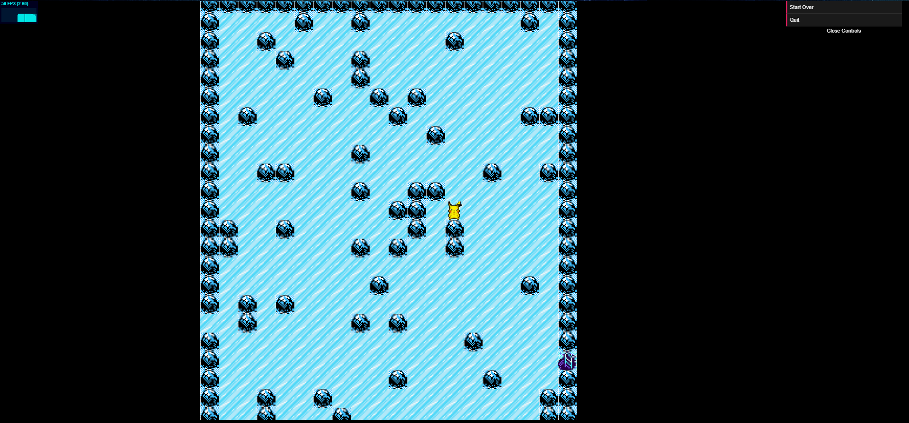

# Ice Puzzle Generator

Demo Link: https://jwang5675.github.io/Ice-Puzzle-Generator/

## Background

This repo contains the base code for a simple ice puzzle generator. The goal of the ice puzzle game is to reach the ending destination. The ice puzzle game works by allowing players to move in a single direction until they hit a boulder as if they were sliding on ice. After the player hits a boulder, they will be able to move in another direction. 

Motivation and Gameplay: https://www.youtube.com/watch?v=hoCfdfRttT8

## Algorithm

Here, I outline the basic algorithm info to generate such ice path puzzles.

Main Algorithm: Input(m, n, difficulty) where (m, n) is the size of the world grid and (difficulty) is a flag denoting how hard the output maze will be.
1. Generate a (m x n) grid that procedurally places boulders on the grid with some defined threshold (t)
2. Generate a random starting point (s) and ending point (e) on the grid
3. Run a modified BFS starting from (s) until it reaches point (e). The modified BFS traverses edges in one direction until a boulder or a wall is reached as a neighboring node.
4. If (e) is unreachable from (s), repeat steps 1 - 3 until a valid map is generated
5. If a valid map generated from (4) satisfies our (difficulty) constraint, output the map. Otherwise, repeats step 1 - 4.

Some important notes to the algorithm: 

- Algorithm runs in O(kx) where x = number of grid cells (m * n) and k is the number of tries needed to make a valid map
- Algorithm is technically not deterministic and can run forever and the value of k can be infinite
- However, for small grids (m, n < 20) and a small boulder threshold (threshold < 15%) this should not pose a problem on runtime as there would be many possible solutions and running BFS on a small (20 x 20) grid with a few actual neighbors from traversing edges runs very fast.
- Assuming k is small, the algorithm runs in approximately linear time.

Some example inputs and outputs to the algorithm:

### MapGenerator.generateMap(20, 25) can output an easy maze from (s) to (e) with 3 steps: URU

    OOOOOOOOOOOOOOOOOOOOOOOeO  
    O.......................O  
    O.......O..O............O  
    O..O....O....O.O........O  
    O....O............O...O.O  
    O........O.O...O....O...O  
    O................OO.....O  
    O......................OO  
    0.............O........OO  
    O..O........O....O...O.OO  
    O.............O.......O.O  
    O.........O...O..O......O  
    O.....................O.O  
    O................O..OOOOO  
    OO.............O....O...O  
    O......O........OO...O..O  
    O.O............OO....O.OO  
    O.....................O.O  
    O..........O...OO.......O  
    OOOOsOOOOOOOOOOOOOOOOOOOO  

### MapGenerator.generateMap(20, 25) can output a medium maze from (s) to (e) with 11 steps: ULDRURULULU

    OOeOOOOOOOOOOOOOOOOOOOOOO  
    OO............O..O....O.O  
    O.OO.....OO.....O.O.....O  
    O...O.O......O.......O..O  
    O............O.O........O  
    O........O........O..O..O  
    O........O...........O..O  
    O......OO...............O  
    O.......................O  
    O.O.O....O...O.O........O  
    O..O..O........O....OOO.O  
    O.O.....................O  
    O.......O..O......O.....O  
    O.....OO............O...O  
    O...OO..O...O.........O.O  
    O.............O...O....OO  
    OO.OOO..O...............O  
    O.......................O  
    O..........OO...........O  
    OOOOOOOOOOOOOOOsOOOOOOOOO  

### MapGenerator.generateMap(20, 25) can output a hard maze from (s) to (e) with 17 steps: URDLURULDLDLDLDRU

    OOeOOOOOOOOOOOOOOOOOOOOOO  
    O...........O..OO.......O  
    O..O..O..O.O..O.........O  
    O...O............OO.....O  
    O........O.....O....O...O  
    O....O..........O...O.OOO  
    O..O..O....O.O..O.....O.O  
    OOO...................O.O  
    OO.O.O.........O......O.O  
    O....O........O...O.....O  
    O..O....O....O....O..O..O  
    O...................O...O  
    O.O..O...O....O.....O...O  
    O...........O...........O  
    O.O.....OO.........O....O  
    OO..................OO..O  
    OO..OO....O.....O...O...O  
    O...........O.........O.O  
    O..OOO..................O  
    OOOOOOOOOsOOOOOOOOOOOOOOO  

## Rendering 

The game is rendered using textures and instanced rendering. Here are the sources for the tilesets that are used within the game:
 - Icy Tile: https://bulbapedia.bulbagarden.net/wiki/File:Ice_C.png
 - Icy Rock: https://www.reddit.com/r/PixelArt/comments/a3849x/ice_cave_dungeon_tiles_knightsoftartarus/
 - End Ladder: https://www.deviantart.com/piacarrot/art/Ice-Path-Tileset-392684771

## Gameplay

The game works by having the user select a game difficulty on the main page. Once the difficulty is selected, the game generates a map based on that difficulty and the user must escape the map by moving the player sprite to the ladder.

How difficulty is determined:
 - Keep generating mazes and solving them with the above algorithm until we find a maze with a certain amount of minimum steps to complete the maze.
 - If a maze requires 3-5 steps to complete, it is an easy maze.
 - If a maze requires 6-9 steps to complete, it is a medium maze.
 - If a maze requires 10+ steps to complete, it is a hard maze.`
